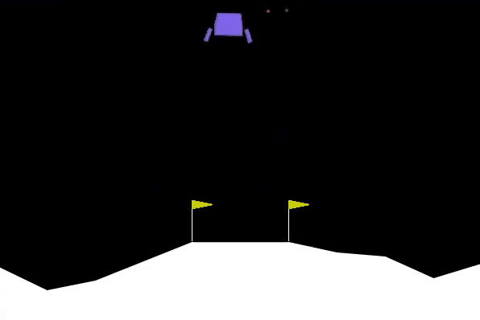

# policy-gradient-baseline-pytorch
AI agent solves CartPole and LunarLander environments in the OpenAi gym using vanilla policy gradient method. The agent uses average rewards as a baseline.

Training : 
  - It uses **monte-carlo method** for learning. (Agent waits till the end of eposides to learn).
  - During an episode trajectory of state, action, rewards are stored. At the end of an episode the neural network approximates the probablity distribution of actions for the states in trajectory.
  - Loss is calculated with the sum of producs of the log probablity of action with discounted rewards in the trajectory.

## Result
Agent with baseline performed better than the agent without baseline.

| Policy Gradient CartPole -v1  | Policy Gradient Baseline Vs NoBaseline |
| :-------------------------:|:-------------------------: |
|  |   |

## Usage
command line arguments : 
`--env` environment (CartPole-v1 or LunarLander-v2)
`--learn` training the agent
 `--play` to make the agent play with the environment
 `-ep` number of episodes to play to train
 `-g` discount factor gamma
 `-lr` learning rate

- To training the agent : run `python agent.py --env LunarLander-v2 --learn -ep 1000`
- To play : run `python agent.py --env LunarLander-v2 --play -ep 5`

  

## Requirements

- [Python](https://www.python.org/downloads/) >= 3.7
- [Pytorch](https://pytorch.org/) >= 1.3.1
- [gym](https://gym.openai.com/)
